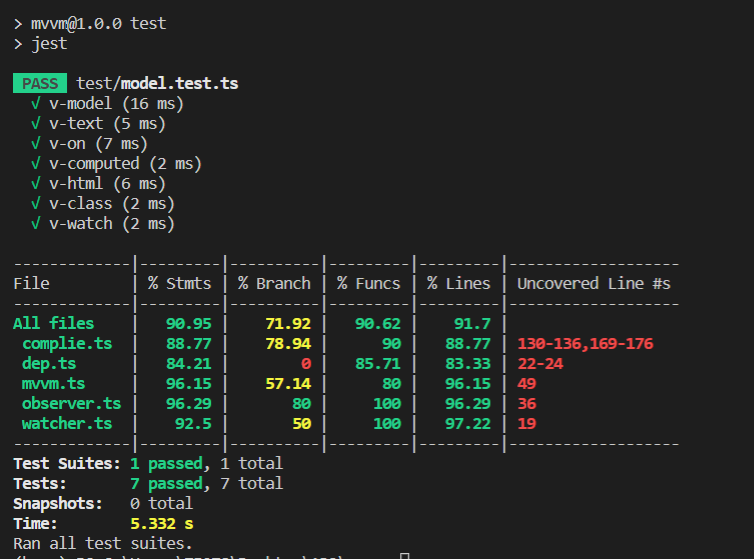

# 2023百度前端实战训练营大作业 —— MVVM

该项目通过`TS+webpack+jest`进行实现

**项目亮点**

1. 通过TypeScript来实现MVVM框架
2. 采用Jest来进行单元测试
3. 具有可扩展性、可复用性以及低耦合性

## 1. 基本介绍

### 1.1 概念

MVVM 框架的全称是 Model-View-ViewModel,它是 MVC（Model-View-Controller）的变种。在 MVC 框架中，负责数据源的模型（Model）可以直接和视图进行交互，而根据软件工程的模块解耦的原则之一，需要将数据和视图分离，开发者只需关心数据，而将视图 DOM 封装，当数据变化时，可以及时地将表现层面对应的数据也同步更新，所以就有了MVVM框架。
在 MVVM 框架中，View 和 Model 之间没有直接的关系，它们是通过 ViewModel 来进行交互的。MVVM 不需要手动操作 DOM ，只需要关注业务逻辑就可以了。

### 1.2 实现方案

在初始化MVVM实例过程中，分别通过**Observer、Compile、Watcher**三个模块来实现数据监听、模板解析以及动态更新各个功能，来实现数据劫持以及发布-订阅模型，从而实现MVVM框架响应式的原理。

具体细节如下图所示:


#### 1.2.1 数据劫持

在该模型中，**数据劫持**的实现采用  `Object.defineProperty()` 劫持传入的 `data`，对 `data` 属性(包括嵌套对象) 的操作进行监听（通过 getter/setter），从而触发一系列响应。也可以使用`Proxy`进行数据劫持。

#### 1.2.2 发布-订阅

**发布-订阅**模式是数据劫持之后的响应，订阅中心 **Dep** 收集对 **Data** 各个属性的依赖，**Watcher** 作为订阅者订阅这些依赖；依赖项的 setter 触发时，会通知对应的 **Watcher**，从而触发更新。

#### 1.2.3 各模块功能

- **MVVM**: Vue 实例初始化，调用 **Observer** 数据劫持，调用 **Compiler** 解析模板；
- **Observer**: 劫持 data 全部属性，定义 setter 、getter，添加和通知订阅者；
- **Compiler**: 解析模板初始化视图，收集模板中的数据依赖，创建订阅者订阅变化，绑定更新函数；
- **Dep**：订阅中心，提供添加、移除、通知订阅的接口；
- **Watcher**: data 属性的订阅者，收到变化通知后调用更新函数更新视图。

## 2. 代码分析

### 2.1 MVVM模块

对应文件: `./src/mvvm.ts`

MVVM 构造函数中把 `options.data`、`options.computed` 中的属性全部绑定到 MVVM `this` 上，这样就能在 `methods` 中通过 `this.xxx` 代理到各自的 key 中.

```typescript
// data 代理，实现 vm._data.xxx -> vm.xxx
_proxyData(key:any) {
    var that = this;
    Object.defineProperty(that, key, {
        configurable: false,
        enumerable: true,
        get: function proxyGetter() {
            return that._data[key];
        },
        set: function proxySetter(newVal) {
            that._data[key] = newVal
        }
    })
}

// computed 属性代理，实现 vm.xxx, this.xxx -> this.$options.computed.xxx
_initComputed() {
    var that = this;
    var computed = this.$option.computed;
    // 查看实例是否具有Computed属性
    if (typeof computed === 'object'){
        Object.keys(computed).forEach(function(key){
            Object.defineProperty(that, key, {
                get: typeof computed[key] === 'function'
                ? computed[key]
                : computed[key].get,
                set: function(){}
            });
        });
    }
}
```

### 2.2 Dep模块

对应文件: `./src/dep.ts`

**Dep** 模块作为**发布-订阅**模式的订阅中心，每个 `data` 中的属性(包括嵌套) 都绑定了一个 `Dep` 实例(通过闭包引用)，提供添加、通知、移除订阅者的接口。一个属性绑定的 `Dep` 实例可以包含多个订阅该属性的 `Watcher` 实例，属性变化后，将通知这些 `Watcher` 实例。

```typescript
class Dep {
    static uid:number = 0;
    public id:number;
    public subs = new Array();
    static target:any = null;

    constructor() {
        // 消息订阅的数组
        this.subs = [];
        this.id = Dep.uid++;
    }

    addSub(sub:any) {
        this.subs.push(sub);
    };

    depend() {
        Dep.target.addDep(this);
    };

    removeSub(sub:any) {
        var index = this.subs.indexOf(sub);
        if (index != -1) {
            this.subs.splice(index, 1);
        }
    };

    notify(){
        // console.log(111)
        this.subs.forEach(function(sub){
            // console.log(sub)
            sub.update()
        })
    }
}
```

### 2.3 Observer模块

对应文件: `./src/observer.ts`

**Observer** 模块依赖 **Dep** 模块。

Observer 构造函数递归劫持 `data` 中的全部属性，定义 getter 和 setter，同时为每个属性绑定一个 Dep 实例。

在属性的 getter 中判断当前 `Dep.target` 是否指向一个 `Watcher` 实例，如果是，则把该 `Watcher` 实例作为属性订阅者添加到 `Dep` 中;在属性的 setter 中当值变化后通过闭包引用的 `Dep` 实例通知订阅者.

```type
defineReactive(data:any, key:any, val:any) {
        var dep = new Dep();
        var childObj = observe(val);
        Object.defineProperty(data, key, {
            enumerable: true,
            configurable: false,
            get: function() {
              	// 访问该 key 时如果 Dep.target 指向 Watcher 实例，把该 key 对应的 Dep 实例传递给 Watcher 实例
  				// 也可以直接 dep.addSub(Dep.target)
                if (Dep.target) {
                    dep.depend();
                }
                return val;
            },
            set: function(newVal) {
                if (newVal === val) {
                    return;
                }
                val = newVal;
                // 新的值是object的话，进行监听
                childObj = observe(newVal);
                // 通知订阅该 key 的 Watcher 实例
                dep.notify();
            }
        })
}
```

`Observer` 模块导出的不是 `Observer class`，而是 `observe` 函数，用于递归实例化 `Observer` 劫持嵌套的 `data key` 对象。相当于 `data` 中的每个嵌套对象都对应一个 `Observer` 实例，包括 `data` 本身。

```typescript
function observe(value:any, vm?:any) {
    if (!value || typeof value !== 'object') {
        return;
    }

    return new Observer(value);
}
```

### 2.4 Watcher 模块

**Watcher** 模块依赖 **Dep** 模块。

`Watcher` 在初始化时将会把 `Dep.target` 指向自身的 `this`，然后访问监听的属性，触发 `Observer` 中定义的属性 getter，从而把当前 `Watcher` 实例添加到属性订阅者中。

```typescript
// 获取 Wacher 实例监视的值
get() {
    // 访问监听的属性时把 Dep.target 指向自身，从而在 Observer 中把当前实例添加到属性订阅者中
    Dep.target = this;
    var value = this.getter.call(this.vm, this.vm);
    // 获取属性值后置空 Dep.target
    Dep.target = null;
    return value;
};
```

如果 `Watcher` 实例监听的是嵌套属性，比如 `a.b.c`，关注的是 `c` 值的变化。则在访问 `a` 时，`a` 绑定的 `Dep` 实例会把当前 `Watcher` 实例添加到订阅者中，同理 `b`、`c`，即一个 `Watcher` 实例的引用同时存在于嵌套属性的父属性 `Dep` 订阅者中；当父属性值变化时，也会通知到子属性的订阅者。

假如相应属性的 `dep.id` 已经在当前 `watcher` 的 `depIds` 里，说明不是一个新的属性，仅仅是改变了其值而已，则不需要将当前 `watcher` 添加到该属性的 `dep` 里。

```typescript
addDep(dep:Dep) {
    if (!this.depIds.hasOwnProperty(dep.id)) {
        dep.addSub(this);
        this.depIds[dep.id] = dep;
    }
};
```

假如相应属性是新的属性，则将当前 `watcher` 添加到新属性的`dep`里，如通过 `vm.child = {name: 'a'}` 改变了 `child.name` 的值，`child.name` 就是个新属性，则需要将当前`watcher(child.name)`加入到新的 `child.name` 的`dep`里。因为此时 `child.name` 是个新值，之前的 `setter`、`dep` 都已经失效，如果不把 `watcher` 加入到新的 `child.name` 的`dep`中，通过 `child.name = xxx` 赋值的时候，对应的 `watcher` 就收不到通知，等于失效了。

### 2.5 Complie模块

**Compiler** 模块依赖 **Watcher** 模块。

**虚拟Dom**

`Compiler` 实例化时先把模板节点的子节点全部转移到 `DocumentFragment` 中进行节点操作，避免频繁 reflow，影响性能；在模板解析完后再把 `DocumentFragment` 转移到根节点下。

```typescript
node2Fragment(el:any) {
    var fragment = document.createDocumentFragment(),
        child;

    // 将原生节点移动到fragment中
    while (child = el.firstChild){
        fragment.appendChild(child);
    }

    return fragment;
};
```

**指令解析**

`Compiler` 解析模板中的 `v-` 前缀的指令和 `{{ exp }}` 文本插值表达式。能够解析的指令有 `v-model`、 `v-class`、`v-text`、`v-html`、`v-on`，这些指令都是引用 `data` 中的属性，触发 `Observer` 定义的 getter 和 setter。

```type
class compileUtil {
	static text() {},
	static html() {},
	static class() {},
	//...
}
```

**双向绑定**

`v-model` 指令绑定的属性，`View` 和 `Model` 中的值变化互相影响，即双向绑定。

监听 `v-model` 指令所在的 `node input` 事件，`input` 变化后通过 `vm.xxx` 改变对应的 `model` 属性值，触发该属性定义的 setter，即实现了 `View` 影响 `Model`。

```typescript
static model(node:any, vm:any, exp:any) {
    this.bind(node, vm, exp, 'model');

    var that = this,
        val = this._getVMVal(vm, exp);
    node.addEventListener('input', function(e:any) {
        var newValue = e.target.value;
        if(val === newValue) {
            return;
        }

        that._setVMVal(vm, exp, newValue);
        val = newValue;
    })
};
```

**属性监听、更新**

每个指令引用的 `data` 属性都需要实例化 `Watcher` 进行监听，并同时绑定更新函数给 `Watcher` 收到变化通知后调用，更新视图; 监听的属性值变化后，每个指令都对应不同的更新操作，比如替换 `textContent`、`innerHTML`、`value` 等.

```typescript
static bind(node:any, vm:any, exp:any, dir:any) {
        var updaterFn = updater[dir + 'Updater'];

        updaterFn && updaterFn(node, this._getVMVal(vm, exp));

        new Watcher(vm, exp, function(value:any, oldValue:any) {
            updaterFn && updaterFn(node, value, oldValue);
        });
};

var updater = {
    textUpdater(node:Node, value:any) {
        node.textContent = typeof value == 'undefined' ? '' : value;
    },
    htmlUpdater(node:Node, value:any) {}
	//...
} 
```

## 测试

- `npm run test` 

jest对应测试代码: `./test/model.test.ts`

分别针对所实现MVVM框架中`v-model`、`v-text`、`v-on`等指令进行测试

运行结果与覆盖率截图如下所示:



## 结果展示

对应文件为: `./index.html 和 ./src/index.ts`

`index.ts`为对应`index.html`入口文件，对应生成指定的MVVM实例进行解析。

通过`npm run dev`即可使用webpack进行本地运行.

通过`npm run build`即可生成打包后的文件

实际效果部署在该页面中: 

http://mvvm.ekkosonya.cn

